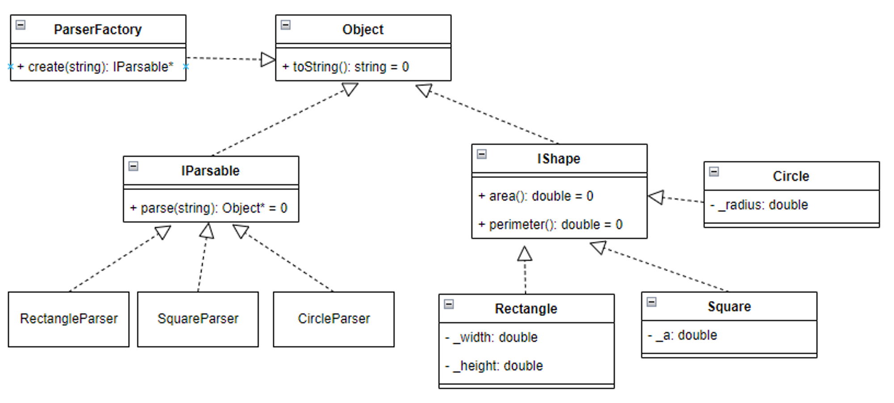

## Working with shapes

- Name your project: **Shapes**
- Given the below main function, write all necessary files to make it run.

```cpp
int main() {
    vector<string> lines = {
        "Square a=12",
        "Circle r=12",
        "Square a=7",
        "Rectangle w=3, h=4",
        "Rectangle w=6, h=8",
        "Circle r=5",
        "Square a=8"
    };

    ParserFactory factory;
    vector<IShape*> shapes;

    for (string line : lines) {
				// Example: line = "Square a=12"
				vector<string> tokens = Utils::String::split(line, " ");
				IParsable* parser = factory.create(tokens[0]); // "Square"=> SquareParser
        IShape* shape = dynamic_cast<IShape*>(parser->parse(tokens[1])); // "a=12" => Square(_a = 12)
        shapes.push_back(shape);
    }

    for (IShape* shape : shapes) { // Polymorphism
        cout << shape->toString() << ": area=" 
            << shape->area() << ", perimeter=" 
            << shape->perimeter() << endl;
    }
}
```

Sample output

```cpp
Square a=12: area=144, perimeter=48
Circle r=12: area=432, perimeter=72
Square a=7: area=49, perimeter=28
Rectangle w=3, h=4: area=12, perimeter=14
Rectangle w=6, h=8: area=48, perimeter=28
Circle r=5: area=75, perimeter=30
Square a=8: area=64, perimeter=32
```

## Hints



```cpp
namespace Utils {
    class String {
    public:
        static vector<string> split(string haystack, string needle) {
            vector<string> result;
            int startPos = 0;
            size_t foundPos = haystack.find(needle, startPos);

            while (foundPos != string::npos) {
                int count = foundPos - startPos;
                string token = haystack.substr(startPos, count);
                result.push_back(token);

                startPos = foundPos + needle.length();
                foundPos = haystack.find(needle, startPos);
            }

            // The remaining
            string token = haystack.substr(startPos, haystack.length() - startPos);
            result.push_back(token);

            return result;
        }
    };
}
```

## Usage of ParserFactory

```cpp
ParserFactory factory;
string name = "Rectangle";
IParsable* parser = factory.create(name); // return new RectangleParser

name = "Circle";
parser = factory.create("Circle"); // return new CircleParser

name = "Square;
parser = factory.create("Circle"); // return new SquareParser
```

So basically, inside the create function is just a switch

```cpp
IParsable* ParserFactory::create(string type) {
    IParsable* parser = NULL;

    if ("Rectangle" == type) {
        parser = new RectangleParser();
    }
    else if ("Square" == type) {
        parser = new SquareParser();
    }
    else if ("Circle" == type) {
        parser = new CircleParser();
    }

    return parser;
}
```

Improvement **01** to make the code shorter and easier to read

```cpp
IParsable* ParserFactory::create(string type) {
		map<string, IParsable*> container = {
			{"Rectangle", new RectangleParser()},
			{"Square", new SquareParser()},
			{"Circle", new CircleParser()}
		}:
    IParsable* result = container [type];

    return parser;
}
```

Improvement **02** to make the code becomes more upgradable

```cpp
// Let use dependency injection
class ParserFactory {
private:
	map<string, IParsable*> _container; // A container for all the dependencies injection
public:
	void registerWith(IParsable* parser) { // Do the injection here 
		_container.insert(
			{parser->parsedObjectName(), parser}
		);
	}

	IParsable* create(string type) {
		return _container[type]; // Ask container to resolve the needed type
	}
}

int main() { // In the beginning of our application
	ParserFactory factory; // We inject what we want to work with here
	factory.registerWith(new RectangleParser());
	factory.registerWith(new SquareParser());
	factory.registerWith(new CirleParser());

	//...
}
```